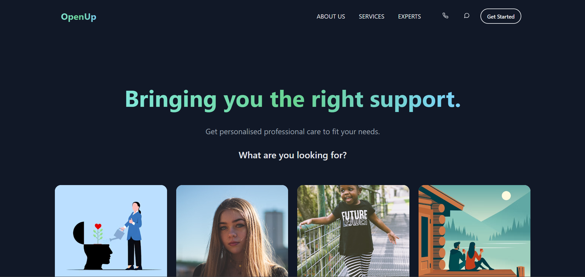
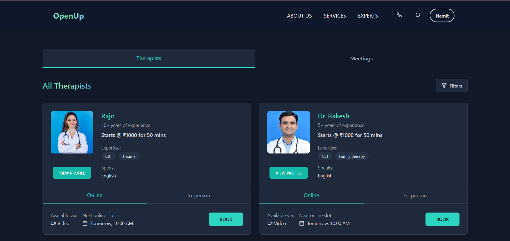
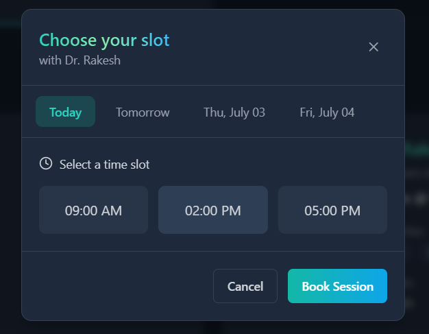
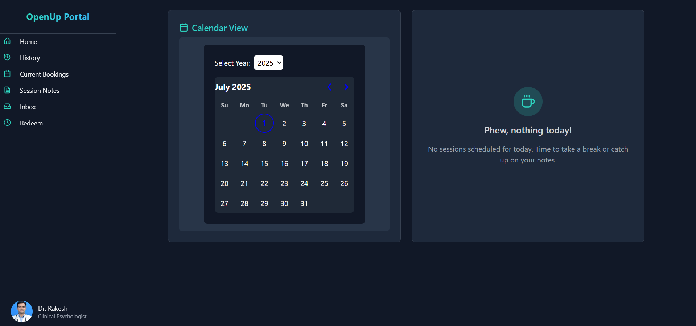

# 🧠 OpenUp - Talk Freely. Heal Fully.

**OpenUp** is a mental wellness web app that connects users with therapists through real-time video communication. It's built with scalability and accessibility in mind—designed for fully online consultations without the need for physical visits or scheduling hassles.

---

## ✨ Features

- 🔐 Secure user authentication (JWT-based)
- 🧍‍♂️ User-friendly onboarding for patients and therapists
- 📹 Real-time video calling using 100ms SDK
- 🗂️ Separate user flows for clients and therapists
- ☁️ Scalable architecture (ready for cloud deployment)
- ⚙️ Built with modern technologies for performance and ease of use

---

## 🛠 Tech Stack

- **Frontend**: React.js + TypeScript + TailwindCSS  
- **Backend**: Node.js + Express + MongoDB  
- **Video SDK**: 100ms  
- **Authentication**: JWT  
- **Others**: Zod, React Hook Form, Axios

---

## 📦 Installation

```bash
# Clone the repo
git clone https://github.com/namit-x/OpenUp
cd openup

# Install dependencies
npm install

# Run the frontend
cd frontend
npm run dev

# Run the backend
cd ../backend
npm run dev
```

Make sure to add your .env variables for both backend and 100ms setup.

## 📷 Sneak Peek
"A picture is worth a thousand lines of code..."
| Home Page                             | Patient Home                           |
|--------------------------------------|----------------------------------------|
|        |       |

| Schedule Modal                         | Therapist Home                         |
|--------------------------------------|----------------------------------------|
|   |            |

## 🤝 Let's Connect
Built with purpose by Namit — developer, student, and someone who believes in using tech to make Impact.
